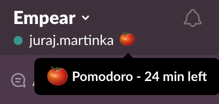

# slack-pom

Update your slack status automatically when using pomodoro technique.

## Motivation

I used [Kanbanflow](https://kanbanflow.com) for simple task management and as a pomodoro timer.
Unfortunately, the timer is only visible on the web page so I had to switch back to chrome when I wanted
to see the reamining time which was quite distracting.
Moreover, I wanted to communicate to my colleagues that I'm in the middle of pomodoro so I might be unresponsive for a while.

## Features

Simple command line application that can start/stop pomodoro session, show pomodoro timer
as a system tray icon as well as a transparent overlay window in the top right corner,
and update slack profile status.

### System Tray Icon

Once the pomodoro session is started, you'll see a pomodoro timer in the "system tray"
(the menu bar at the very top of the screen on my Max OS):


**Gotcha**: 
If you have many apps with a system tray icon, it can happen that you won't see 
the pomodoro timer in the system tray because there's not enough place for it.
This is the primary reason why there's an complementary visualization method using overlay window.
Check [Seeing All Icons on the Menu Bar](https://apple.stackexchange.com/questions/145187/seeing-all-icons-on-the-menu-bar).

### Overlay Window in the Top Right Screen corner

In addition to the system tray icon, the pomodoro timer with a minute granularity is shown
in the top right screen corner:


### Slack Profile Status Update

Once the pomodoro session is started you should see your slack profile status updated
with a nice tomato icon:



## Configuration

You need to provide a proper slack API token for your slack workspace: https://api.slack.com/tutorials/tracks/getting-a-token
The token must have `users.profile:write` permission scope - as of 2023,
only _user_ tokens can do that: https://api.slack.com/authentication/token-types#user

Once you have the token, create custom [`config.edn`](resources/config.edn) file in the root directory (the directory
where the program is run).

You don't have to modify [built-in `config.edn` file](resources/config.edn).
This is used as a template and also to provide defaults for optional keys.
Just copy it and provide the required config.


## Usage

WARNING: the application has only been tested on Mac OS High Sierra 10.13.3.

### Run from the source

This is preferable unless you really want to build an uberjar and run it as `java -jar`.

Use `clj -X`: https://clojure.org/guides/deps_and_cli#_using_a_main

```
clj -X slack-pom.core/-main
```

There's a handy wrapper script for this: ``slack-pom.sh`.

### Build and Run

#### Build jkeymaster dependency (submodule)

Switch to the jkeymaster submodule dependency/folder
and build it:
```
mvn -DskipTests=true clean install
```

This should install the version 1.4-SNAPSHOT into your local maven repo.
That's then used in deps.edn
```
        com.github.tulskiy/jkeymaster {:mvn/version "1.4-SNAPSHOT"}}
```


#### deps.end (build-clj)

```
clojure -T:build org.corfield.build/uber :lib net.curiousprogrammer/slack-pom :main slack-pom.core
```

#### Leiningen (obsolete)
```
lein uberjar
java -jar target/uberjar/slack-pom-0.1.0-SNAPSHOT-standalone.jar
```

Alternatively, you can run `lein repl` and call functions from `slack-pom.core` namespace directly.

### Global Keyboard Shortcuts

When application is started, it tries to register native global hook for keyboard shortcuts
using [JKeyMaster](https://github.com/tulskiy/jkeymaster) library.
That means you usually need to add necessary permissions.
On Mac OS this is done in `System Preferences -> Security & Privacy -> Accessibility`.
System should show a dialog asking for such a permission during the first application run.
Add the required permission and restart the application.

Following shortcuts are registered automatically for you:

* Ctrl + Alt + Cmd + ,   (start pomodoro session with default duration)
* Ctrl + Alt + Cmd + .   (stop pomodoro)

Note that `Cmd` key is also known as `Meta` in `jnativehook` terminology.

### Using Command-Line Interface

Although the global keyboard shortcuts are the easiest way to interact with the application,
you can also interact with it through the cmd interface. 
The help is printed when the application is started:

```
Hello!
   Commands
     sp [duration-in-minutes]:    start pomodoro    - keyboard shortcut [CTRL + ALT + CMD (meta) + ,]
     tp:                          stop pomodoro     - keyboard shortcut [CTRL + ALT + CMD (meta) + .]
     h:                           help
     q:                           quit
```

E.g. to start a longer 50-minute session you can use `sp 50` command:
```
sp 50
Stop pomodoro task.
Update slack status:
Start pomodoro task.
Update slack status:  Pomodoro - 50 min left

```

## License

Copyright © 2018 Juraj Martinka (https://jurajmartinka.com/)

Distributed under the Eclipse Public License either version 1.0 or (at
your option) any later version.
